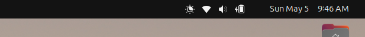

[](https://extensions.gnome.org/extension/6949/moveclock/)

#  moveclock

GNOME extension designed to reposition the clock on the right side of the panel


## Overview

**Moveclock** is a GNOME extension designed to reposition the clock on the right side of the panel, inspired by the **Frippery Move Clock**. This extension moves the status panel to the left of the clock, creating a look similar to macOS. Disabling the extension reverts the clock and status panel to their default positions. It is currently compatible with **GNOME 46** and has been tested on **Ubuntu 24.04 LTS**.


## Installation

Ensure you log out and log back in after installation to allow the GNOME shell to update.

### From extensions.gnome.org

1. Visit [extensions.gnome.org](https://extensions.gnome.org/extension/6949/moveclock/)
2. Click the install button.

### From the Latest Github Release

1. Download the [latest release from Github](https://github.com/kuvaus/moveclock/releases/latest/download/moveclock@kuvaus.org.shell-extension.zip) using wget:

```bash
wget https://github.com/kuvaus/moveclock/releases/latest/download/moveclock@kuvaus.org.shell-extension.zip
```

2. Install the extension with the following command. The `--force` option is only necessary if you're overwriting an existing installation:

```bash
gnome-extensions install --force moveclock@kuvaus.org.shell-extension.zip
```

### From Source Code

1. Clone the [latest source code from Github](https://github.com/kuvaus/moveclock):

```bash
git clone https://github.com/kuvaus/moveclock
```

2. Run the `install.sh` script:

```bash
cd moveclock
./install.sh
```

Alternatively, you can manually run the commands executed by the script:

```bash
cd moveclock
glib-compile-schemas schemas/
gnome-extensions pack . --force
gnome-extensions install --force moveclock@kuvaus.org.shell-extension.zip
```

## Usage

After installation, the extension should automatically activate upon your next login. Use the following commands for managing the extension:

- **List**: List all your gnome-extensions. Get the `<extension name>` from here.

```bash
gnome-extensions list
```

- **Enable**: Activates the extension and repositions the clock and status panel.

```bash
gnome-extensions enable <extension name>
```

- **Disable**: Deactivates the extension and reverts the clock and status panel to their default positions.

```bash
gnome-extensions disable <extension name>
```

- **Prefs**: Opens the preferences page, which includes a link to this Github page for downloading newer versions.

```bash
gnome-extensions prefs <extension name>
```

## Author

**kuvaus**

## License

**GPLv3**
